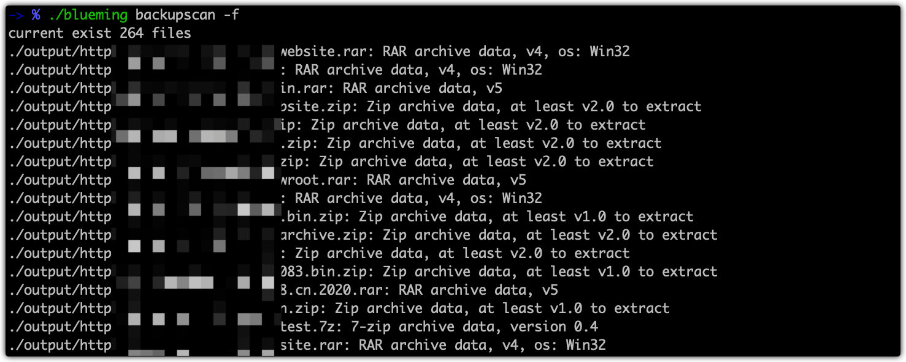

## 简介

> 最近挺喜欢听IU的blueming，所以命名为blueming
> 
> 获取网站备份文件,以及目录扫描,被动扫描

## 使用

```bash
Usage:
  blueming [command]

Available Commands:
  backupscan  backupscan scan
  dirscan     dirscan scan
  help        Help about any command
  passive     passive scan

Flags:
  -h, --help   help for blueming

Use "blueming [command] --help" for more information about a command.
```

### backupscan

1. 启动扫描

   ```bash
   └> ./blueming backupscan -u http://xx.xx.xx.xx:xxx
   [INFO] 08-27 09:04:15 cmd/blueming/main.go:192 1 个URL, 100 线程, 10 超时
   [INFO] 08-27 09:04:15 internal/core/core.go:93 start scan backup
   ...
   ```

2. 清洗结果(新开终端/或等待任务结束后进行清洗)

   

### dirscan

> 不是重点

### passive

> 不是重点

## TODO

> 基本满足以下要求即可

- [ ] 常见文件泄露扫描 .git .hg .idea .DS_Store ...
- [x] 提取域名关键字进行目录扫描
- [ ] 日志文件扫描: 指定扫描地址，计算头一天的日期，根据日期生成字典，可定制日期出现的位置
  "image$TIME$" "pay.$time$"
- [x] 开启被动扫描模式，配合httpx自动进行目录扫描(二级、三级、四级...)
- [x] 通过URL自动生成文件名
- [x] 根据后缀名将URL定义为对应的文件格式，如zip、tar.gz等
- [x] 自动下载备份文件，并进行重命名
- [x] 能够自定义字典
- [x] 优化内存占用
- [x] filter.sh 移至程序内部
- [x] 目录扫描部分添加 页面相似度比较，每个新产生的都会与前面所有的请求进行比较一次(耗时)
  - 比较时，各网站相互独立，采用协程的方式
- [x] 采用 GET 请求，查看文件过大时的response
  - 文件过大导致的超时 则获取 header，比较历史记录中的length
  - 正常情况，比较body
